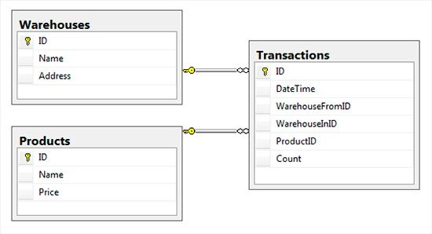
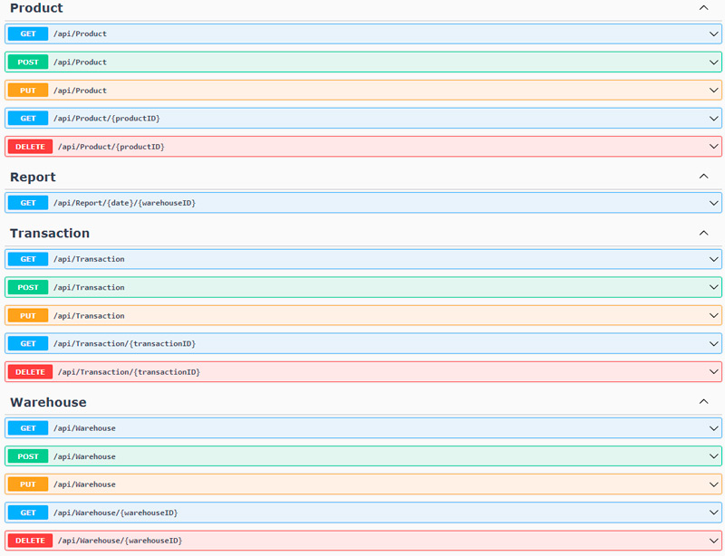

# ASPNETCoreWebAPI-React

Example of a client-server application with ASP.NET Core web API as a server (backend) and React SPA as a client (frontend).

# About

Tried to implement a RESTful service sample using ASP.NET Core Web API with controllers as a server and React SPA (using functional components with hooks) as an independent client. This project was used as a training base to improve technical skills. So nothing serious, just a learning project with REST architectural style and basic functionality:
- CRUD methods;
- Pagination (backend);
- Sorting (frontend);
- Filtering (frontend).

## Backend:
- REST API;
- ASP.NET Core 6.0;
- Entity Framework Core 6.0.5;
- MS SQL Server 2014;
- Swashbuckle 6.2.3.

## Frontend:
- React 18.1.0;
- React-Bootstrap 2.4.0;
- Bootstrap 5.1.3;
- Fetch API.

## Database schema:

# How to run

1. `$ git clone https://github.com/artgl42/ASPNETCoreWebAPI-React.git`
2. Visual Studio -> Open **ASPNETCoreWebAPI-React.sln** -> Build and run 
   
   >don't forget to change *ConnectionStrings* in **appsettings.json** to your SQL Server location (database will be created automatically)

3. `$ cd ASPNETCoreWebAPI-React/react-client`
4. `$ npm install`
5. `$ npm start`

# API Endpoints

# Screenshots

 and React SPA as a client (frontend)")